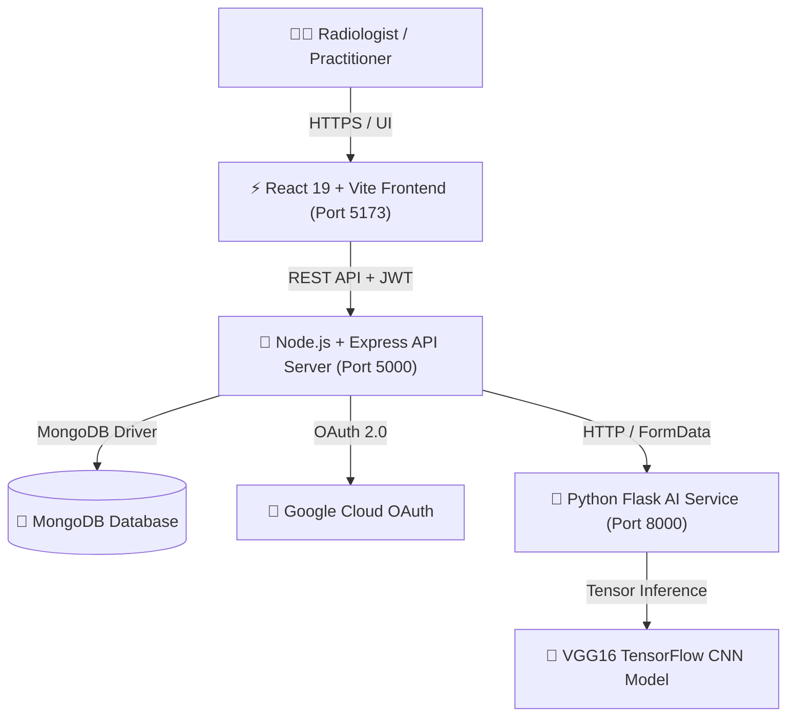

# 🧠 NeuroScan AI — AI-Powered Brain Tumor Detection Platform

[](https://react.dev/)
[](https://www.typescriptlang.org/)
[](https://vitejs.dev/)
[](https://tailwindcss.com/)
[](https://nodejs.org/)
[](https://expressjs.com/)
[](https://www.mongodb.com/)
[](https://www.python.org/)
[](https://www.tensorflow.org/)
[](LICENSE)

---

## 📋 Table of Contents

- [Overview](#-overview)
- [Key Capabilities & Features](#-key-capabilities--features)
- [System Architecture](#-system-architecture)
- [Technology Stack](#-technology-stack)
- [Project Directory Structure](#-project-directory-structure)
- [Getting Started](#-getting-started)
  - [Prerequisites](#prerequisites)
  - [1. Clone Repository](#1-clone-repository)
  - [2. MongoDB Setup](#2-mongodb-setup)
  - [3. Backend API Setup](#3-backend-api-setup)
  - [4. AI Microservice Setup](#4-ai-microservice-setup)
  - [5. Frontend Web App Setup](#5-frontend-web-app-setup)
- [Environment Configuration](#-environment-configuration)
- [API Reference](#-api-reference)
- [Radiology Report & Print Specifications](#-radiology-report--print-specifications)
- [Security & Authentication](#-security--authentication)
- [Troubleshooting](#-troubleshooting)
- [License & Citation](#-license--citation)

---

## 🌟 Overview

**NeuroScan AI** is a state-of-the-art, production-grade medical web platform built for neuroradiologists, oncologists, and clinical practitioners. It leverages a customized **VGG16 Convolutional Neural Network (CNN)** trained on brain MRI scans to perform automated classification into four distinct diagnostic categories:

- **Glioma**
- **Meningioma**
- **Pituitary Tumor**
- **No Tumor** *(Normal Brain Parenchyma)*

The platform includes real-time neural heatmap visualizers (GradCAM feature maps), interactive confidence scoring, clinical probability distribution analytics, instant printable diagnostic PDF report generation, full user account management, and MongoDB-backed audit history tracking.

---

## ✨ Key Capabilities & Features

### 1. 🧠 AI Diagnostic Inference & Feature Mapping
- **TensorFlow VGG16 Neural Engine**: Processes 128x128 3-channel RGB brain MRI tensors with sub-2-second inference latency.
- **Neural Confidence & Class Probabilities**: Computes detailed confidence scores and probability breakdowns across all 4 tumor categories.
- **GradCAM Heatmap Overlay**: Generates visual activation maps highlighting regional neural network focus on brain tissue slice acquisitions.
- **Assessed Risk Categorization**: Automatically evaluates risk level (*High*, *Medium*, *Low*) based on tumor classification and model confidence.

### 2. 📄 Medical Radiology Report Engine
- **Dynamic Patient Information Binding**: Patient Name, Age, and Gender entered during scan upload automatically populate diagnostic reports without default placeholders.
- **Clean Printable PDF Export**: Optimized `@media print` layout that completely hides navigation bars, sidebars, breadcrumbs, profile controls, and buttons during print/export.
- **Single-Click Export**: Instant PDF download and native browser print dialog support compliant with clinical radiology standards.

### 3. 🔐 Enterprise Authentication & Account Security
- **Dual Authentication**: Native email/password authentication and Google OAuth 2.0 single sign-on with JWT session management.
- **Registration Flow**: Redirects users to the Sign-In page with a success confirmation banner after complete account creation.
- **Password Visibility Toggles**: Interactive `Eye` / `EyeOff` controls on all sign-in and sign-up password fields.
- **6-Digit OTP Password Recovery**: Multi-layered OTP generation, in-memory & database persistence, EmailJS inbox dispatch, and strict autofill protection (`autoComplete="off"` / `autoComplete="one-time-code"`).
- **Permanent Account Deletion**: Cascading deletion endpoint (`DELETE /api/auth/account`) that permanently purges user credentials and prediction history from MongoDB and local stores.

### 4. 📊 Radiologist Dashboard & Audit Trail
- **Analytics Overview**: Stat counters (Total Scans, Normal Parenchyma, Detected Abnormalities, Average Confidence).
- **Visual Analytics**: Interactive Recharts pie charts for classification distribution and line graphs for monthly diagnostic trends.
- **Prediction History Archive**: Searchable, filterable, and sortable historical scan audit trail with item deletion capabilities.
- **Profile & Institution Customization**: Radiologist profile customization without forced default hospital placeholders.

---

## 🏗️ System Architecture



---

## 🛠️ Technology Stack

| Layer | Technology | Key Libraries / Frameworks |
| :--- | :--- | :--- |
| **Frontend** | React 19, TypeScript | Vite, Tailwind CSS, Framer Motion, Recharts, Lucide React, HTML2Canvas, Canvas Confetti |
| **Backend API** | Node.js (v18+) | Express.js, MongoDB / Mongoose, Passport.js, JWT, Bcrypt.js, Helmet, Multer, Axios |
| **AI Engine** | Python (3.9+) | Flask, TensorFlow / Keras (VGG16), NumPy, Pillow (PIL), Flask-CORS |
| **Integrations** | EmailJS, Google OAuth | `@emailjs/browser`, `passport-google-oauth20` |

---

## 📂 Project Directory Structure

```
NeuroScanAI/
├── frontend/                     # React 19 + TypeScript Frontend
│   ├── src/
│   │   ├── components/           # UI Components (Landing, MRI Visualizer, Layout, Modals)
│   │   ├── context/              # AuthContext, ThemeContext, PredictionContext
│   │   ├── layouts/              # DashboardLayout, MainLayout
│   │   ├── pages/                # Upload, Prediction, Report, History, Settings, Auth Pages
│   │   ├── services/             # authService, predictionService, api client
│   │   ├── types/                # TypeScript interfaces and type definitions
│   │   └── utils/                # Formatters, helpers, print helpers
│   ├── index.html
│   ├── package.json
│   └── vite.config.ts
├── backend/                      # Node.js + Express REST API Server
│   ├── config/                   # MongoDB connection & Passport OAuth setup
│   ├── controllers/              # authController, predictionController
│   ├── middleware/               # authMiddleware, file upload handlers
│   ├── models/                   # User and Prediction Mongoose schemas
│   ├── routes/                   # authRoutes, predictionRoutes
│   ├── app.js                    # Express app initialization
│   ├── server.js                 # HTTP server listener
│   └── package.json
├── ai-model/                     # Python Flask Deep Learning Inference Engine
│   ├── model/                    # Saved VGG16 H5 model weights (`brain_tumor_model.h5`)
│   ├── app.py                    # Flask API service & image preprocessing pipeline
│   └── requirements.txt          # Python dependencies
└── README.md
```

---

## 🚀 Getting Started

### Prerequisites

Ensure you have the following installed on your machine:
- **Node.js**: v18.0.0 or higher ([Download Node](https://nodejs.org/))
- **Python**: v3.9 or higher ([Download Python](https://www.python.org/))
- **MongoDB**: Local MongoDB instance or MongoDB Atlas Connection URI ([Download MongoDB](https://www.mongodb.com/try/download/community))
- **Git**: Installed for cloning the repository

---

### 1. Clone Repository

```bash
git clone https://github.com/Shayanghosh03/NeuroScan-AI.git
cd NeuroScanAI
```

---

### 2. MongoDB Setup

Make sure your MongoDB server is running locally on port `27017` or prepare your MongoDB Atlas URI.

**Using Docker (Optional):**
```bash
docker run -d -p 27017:27017 --name neuroscan-mongo mongo:latest
```

---

### 3. Backend API Setup

```bash
cd backend
npm install
```

Create a `.env` file in the `backend/` root:
```env
PORT=5000
NODE_ENV=development
MONGODB_URI=mongodb://localhost:27017/neuroscanai
JWT_SECRET=neuroscan-jwt-secret-key-2026
JWT_EXPIRE=7d
AI_MODEL_URL=http://localhost:8000
GOOGLE_CLIENT_ID=your-google-client-id
GOOGLE_CLIENT_SECRET=your-google-client-secret
GOOGLE_CALLBACK_URL=http://localhost:5000/api/auth/google/callback
SESSION_SECRET=neuroscan-session-secret-2026
```

Start the Backend Development Server:
```bash
npm run dev
```
*Server starts on `http://localhost:5000`*

---

### 4. AI Microservice Setup

Open a new terminal window:
```bash
cd ai-model
python -m venv venv
# On Windows:
venv\Scripts\activate
# On macOS/Linux:
source venv/bin/activate

pip install -r requirements.txt
```

Create a `.env` file in the `ai-model/` root:
```env
PORT=8000
FLASK_ENV=development
MODEL_PATH=./model/brain_tumor_model.h5
IMAGE_SIZE=128
```

Start the Python AI Service:
```bash
python app.py
```
*AI service starts on `http://localhost:8000`*

---

### 5. Frontend Web App Setup

Open a third terminal window:
```bash
cd frontend
npm install
```

Create a `.env` file in the `frontend/` root (Optional for custom API URLs or EmailJS):
```env
VITE_API_BASE_URL=http://localhost:5000/api
VITE_EMAILJS_SERVICE_ID=service_azhfbua
VITE_EMAILJS_AUTOREPLY_TEMPLATE_ID=template_rrubd8s
VITE_EMAILJS_PUBLIC_KEY=OsYSMeTXW8DpUKaB0
```

Start the Vite Frontend Development Server:
```bash
npm run dev
```
*App will open on `http://localhost:5173`*

---

## 📡 API Reference

### Backend Endpoints (`http://localhost:5000/api`)

| Method | Endpoint | Access | Description |
| :--- | :--- | :--- | :--- |
| `POST` | `/auth/register` | Public | Register new radiologist account |
| `POST` | `/auth/login` | Public | Authenticate user & return JWT token |
| `GET` | `/auth/me` | Private | Retrieve current user profile |
| `PUT` | `/auth/profile` | Private | Update user profile (name, hospital, avatar) |
| `DELETE` | `/auth/account` | Private | Permanently delete account and user data |
| `POST` | `/auth/forgot-password` | Public | Verify email & generate 6-digit OTP code |
| `POST` | `/auth/reset-password` | Public | Reset password using 6-digit OTP code |
| `GET` | `/auth/google` | Public | Initiate Google OAuth 2.0 authentication |
| `GET` | `/auth/google/callback` | Public | Handle Google OAuth callback |
| `POST` | `/predict` | Private | Upload MRI scan and obtain AI classification |
| `GET` | `/history` | Private | Fetch prediction history for logged-in user |
| `DELETE` | `/history/:id` | Private | Delete specific history report |
| `DELETE` | `/history` | Private | Purge all history reports |

---

## 📄 Radiology Report & Print Specifications

The report document ([ReportPage.tsx](file:///c:/Users/Shayan/Documents/03.%20PROJECTS/NeuroScanAI/frontend/src/pages/ReportPage.tsx)) includes built-in `@media print` rules designed for hospital record management:

- **Patient Metadata Grid**: Formatted in 3 distinct columns (**Patient Name**, **Age / Gender**, **Scan Date**).
- **Clean Document Isolation**: Printing automatically suppresses:
  - Sidebar drawer & navigation headers
  - Breadcrumb trails (`Home > Medical Report > REP-...`)
  - Theme toggles & notification popovers
  - User profile avatars and action buttons
- **Paper Output**: Fits standard A4 portrait pages (`margin: 10mm 12mm`).

---

## 🔐 Security & Authentication

1. **JWT Encryption**: Stateless authentication tokens signed with HS256 algorithm.
2. **Password Hashing**: Bcrypt salted hashing with 10 salt rounds.
3. **Password Manager Defense**: Password reset forms enforce `autoComplete="off"`, `autoComplete="one-time-code"`, and `autoComplete="new-password"` attributes.
4. **Permanent Account Purge**: Deleting an account purges records from MongoDB and local browser storage.

---

## 🐛 Troubleshooting

### 1. MongoDB Offline / Timeout
- Ensure `mongod` process is active on port `27017`.
- If running without MongoDB, the application seamlessly uses a local in-memory store for evaluation.

### 2. AI Model Service Error (Port 8000)
- Ensure TensorFlow and Pillow are installed in your Python environment: `pip install -r requirements.txt`.
- Verify model file exists at `ai-model/model/brain_tumor_model.h5`.

### 3. Google OAuth Redirect Mismatch
- Verify authorized redirect URI in Google Cloud Console is set to `http://localhost:5000/api/auth/google/callback`.

---

## 📄 License

Distributed under the **MIT License**. See `LICENSE` for details.

---

<p align="center">
  <b>NeuroScan AI Workstation v2.4</b> — Built with ❤️ Shayan Ghosh.
</p>
